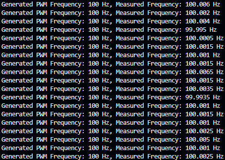
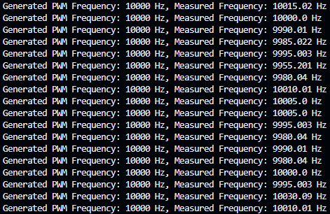
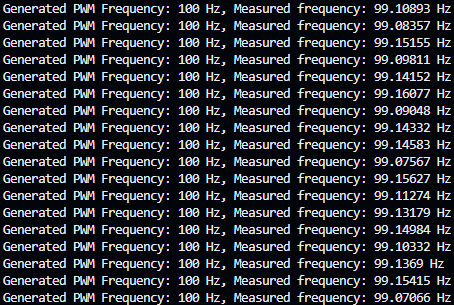
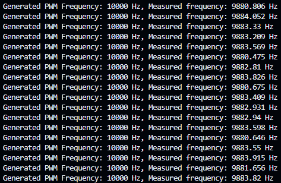
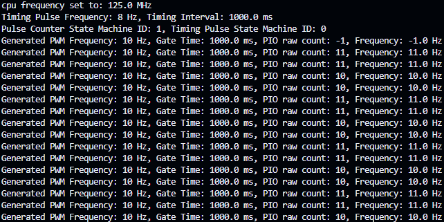
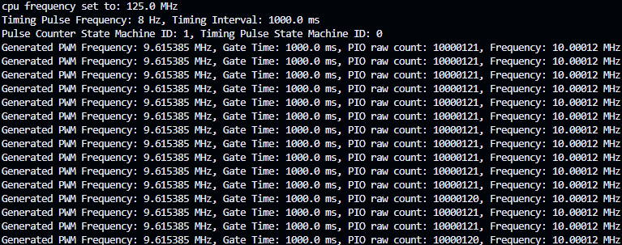

# Pi Pico PIO Frequency Measurement Program

This project is a MicroPython program designed to measure the frequency of a PWM signal using the Raspberry Pi Pico's PIO (Programmable Input/Output) and interrupts. The program is capable of counting the number of input pulses within a specified gate time, thereby calculating the frequency of the input signal with high accuracy.

## Table of Contents

- [Project Description](#project-description)
- [Key Features](#key-code-components)
- [Setup Instructions](#setup-instructions)
- [Usage](#usage)
- [Project Structure](#project-structure)
- [Contact](#contact)

## Project Description

The program utilizes the Pi Pico's PIO to create a high-precision frequency counter. It involves two PIO state machines:

1. **Pulse Counter**: Counts the number of falling edges of an input pulse during a defined gate time.
2. **Timing Pulse Generator**: Generates timing pulses for the pulse counter, ensuring accurate frequency measurement by providing a reliable timing pulse.

### Key Features

- **32-bit Counter**: Utilizes the Pi Pico’s 32-bit scratch register, enabling the program to handle a wide range of frequencies.
- **Accurate Timing**: A dedicated GPIO pin generates timing pulses, providing a reliable time interval for measurement. This is crucial as the `time.sleep()` and timer methods in MicroPython are not sufficiently accurate for precise timing, as demonstrated in `frequency_counter_timer_method.py` and `frequency_counter_interrupt.py`.

  - The issues with using `time.sleep()` or Timer method include limited maximum frequency handling (approximately 10 kHz) and inaccurate timing due to frequent interrupts.

  - **Results with Different Methods**:
    - `frequency_counter_timer_method.py` using a callback function with Timer:
      - 
      - 
    - `frequency_counter_interrupt.py` using a single PIO machine to count pulses:
      - 
      - 
    - **Reciprocal Method**: Measures PWM frequencies from 10 Hz to 10 MHz with high accuracy:
      - 
      - 

- **Hardware-Linked Timing**: The timing pulse is generated by the Pi Pico's hardware PWM, operating at 8 Hz (the lowest possible in MicroPython at the default 125 MHz CPU frequency). This ensures that the timing is unaffected by CPU interrupts or other MicroPython-related delays.
- **Side-set Pin for Gate Control**: Another GPIO pin acts as the side-set pin, where the timing pulse state machine signals the pulse counter PIO to start and stop counting by toggling the side-set pin.
- **CPU Independence**: The PIO method allows pulse counting without CPU involvement, with the PIO pushing the result to the FIFO every 1 second.
- **Interrupt Alignment**: An interrupt ensures that the timing pulse is synchronized with the actual PWM signal, enhancing measurement accuracy.

## Setup Instructions

1. **Clone the Repository**:

   ```sh
   git clone https://github.com/your-username/pi-pico-frequency-measurement.git
   cd pi-pico-frequency-measurement
   ```

2. **Upload the Program**:

   - Copy the `frequency_counter_pio_reciprocal_with_interrupt.py` file to your Raspberry Pi Pico using your preferred method (e.g., Thonny, rshell, ampy).

3. **Connect the Hardware**:
   - **PWM Output Pin** (`PWM_OUTPUT_PIN_ABSOLUTE = 0`): Connect this to the pin generating the PWM signal you want to measure.
   - **Input Pulse Pin** (`INPUT_PULSE_PIN_ABSOLUTE = 2`): Connect this to the pin where you want to measure the frequency.
   - **Timing Pulse Pin** (`TIMING_PULSE_PIN_ABSOLUTE = 3`): This pin generates timing pulses to control the gate time.
   - **Side-set Pin** (`SIDESET_PIN_ABSOLUTE = 1`): Controls the timing for starting and stopping the pulse counting.

## Key Code Components

### 1. **Pulse Counting PIO Program**

- **`pulse_counter_pio`**: This PIO program counts the number of pulses on the input pin during the gate time controlled by the side-set pin. It waits for the side-set pin to be set before starting the count and then pushes the count to the FIFO once the gate time ends. The counter is a 32-bit register, providing a broad range of frequency measurement capabilities.

### 2. **Timing Pulse Generator PIO Program**

- **`timing_pulse_pio`**: This PIO program generates timing pulses to control the side-set pin, effectively managing the gate time for pulse counting. It reads an 8 Hz PWM pulse generated by the Pi Pico hardware and waits for 8 cycles before signaling the pulse counter PIO to stop counting. This creates an accurate 1-second time interval, unaffected by MicroPython’s timing inaccuracies.

### 3. **PulseCounter Class**

- This class manages the state machines for pulse counting and timing pulse generation. It handles initialization, starting, stopping, and reading of pulse counts. The class also includes a callback function that uses interrupts to align the timing pulse with the actual PWM pulse, ensuring accurate synchronization.

### 4. **Main Function**

- The `main()` function sets up the environment, initializes the pulse counter, and continuously measures and prints the frequency of the input signal. The function also handles stopping the program gracefully on a keyboard interrupt.

## Usage

1. **Run the Program**:

   - Once the program is uploaded to the Pi Pico, run it using the MicroPython REPL or an IDE like Thonny.

2. **Monitor Output**:

   - The program will output the measured frequency of the PWM signal in Hz, kHz, or MHz depending on the signal's frequency. Because the timing is hardware-linked and independent of the CPU, the measurements are highly accurate.

3. **Adjusting Parameters**:
   - You can adjust the timing pulse frequency, the CPU frequency, and other parameters directly in the `main()` function or within the `timing_pulse_generator()` function.

## Project Structure

```
pi-pico-frequency-measurement/
├── frequency_counter_pio_reciprocal_with_interrupt.py # Main program file
├── README.md # Project documentation
```

## Contact

For any issues, questions, or contributions, please open an issue or submit a pull request on GitHub.
